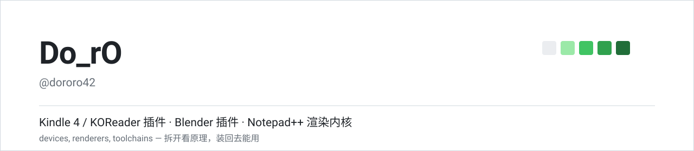
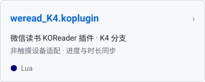
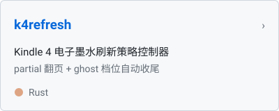
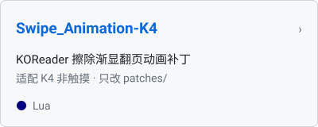
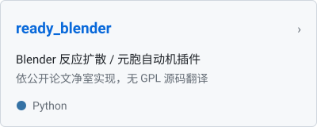
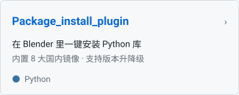
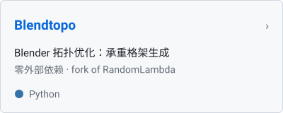
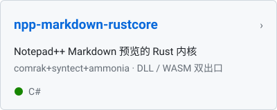
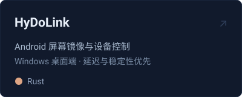
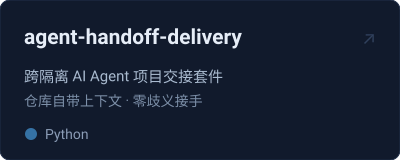

<br>

### Kindle 4 / KOReader

<table>
  <tr>
    <td width="33.3%">
      <a href="https://github.com/dororo42/weread_K4.koplugin"></a>
    </td>
    <td width="33.3%">
      <a href="https://github.com/dororo42/k4refresh"></a>
    </td>
    <td width="33.3%">
      <a href="https://github.com/dororo42/Swipe_Animation-K4"></a>
    </td>
  </tr>
</table>

### Blender

<table>
  <tr>
    <td width="33.3%">
      <a href="https://github.com/dororo42/ready_blender"></a>
    </td>
    <td width="33.3%">
      <a href="https://github.com/dororo42/Package_install_plugin"></a>
    </td>
    <td width="33.3%">
      <a href="https://github.com/dororo42/Blendtopo"></a>
    </td>
  </tr>
</table>

### 其他

<table>
  <tr>
    <td width="33.3%">
      <a href="https://github.com/dororo42/npp-markdown-rustcore"></a>
    </td>
    <td width="33.3%">
      <a href="https://github.com/dororo42/HyDoLink"></a>
    </td>
    <td width="33.3%">
      <a href="https://github.com/dororo42/agent-handoff-delivery"></a>
    </td>
  </tr>
</table>

### 技术栈

<p>
  
  
  
  
  
  
  
  
</p>

### 衍生分支

在别人项目上做简化、移植与稳定性修复，保留 fork 关系以便回溯上游：

| 仓库 | 上游 | 方向 |
| :-- | :-- | :-- |
| [npp-markdown-rustcore](https://github.com/dororo42/npp-markdown-rustcore) | [mohzy83/NppMarkdownPanel](https://github.com/mohzy83/NppMarkdownPanel) 0.9.3 | 渲染管线下沉到 Rust 共享核心 |
| [weread_K4.koplugin](https://github.com/dororo42/weread_K4.koplugin) | [finlater/weread.koplugin](https://github.com/finlater/weread.koplugin) | K4 非触摸适配分支，独立维护 |
| [EZVenera](https://github.com/dororo42/EZVenera) | [WEP-56/EZVenera](https://github.com/WEP-56/EZVenera) | 简化重写，只出 Windows / Android 包体 |
| [Breeze](https://github.com/dororo42/Breeze) | [deretame/Breeze](https://github.com/deretame/Breeze) | Flutter 漫画阅读器，插件化多源 |
| [GBAStation](https://github.com/dororo42/GBAStation) | [beiklive/GBAStation](https://github.com/beiklive/GBAStation) | 基于 borealis 的多内核前端 |
| [Blendtopo](https://github.com/dororo42/Blendtopo) | [RandomLambda/Blendtopo](https://github.com/RandomLambda/Blendtopo) | Blender 拓扑优化 |
| [reverse-skill](https://github.com/dororo42/reverse-skill) | [zhaoxuya520/reverse-skill](https://github.com/zhaoxuya520/reverse-skill) | 逆向 / 授权渗透技能路由包 |

其余在做的：[EZVenera4KO](https://github.com/dororo42/EZVenera4KO) ·
[birding](https://github.com/dororo42/birding)

<br>

<details>
<summary>统计卡片（默认关闭，取消 README 注释即可启用）</summary>

统计图依赖第三方渲染服务，页面每次加载都会发起外部请求，所以这里不默认开启。

```
<!--
<table>
  <tr>
    <td></td>
    <td></td>
  </tr>
</table>
-->
```

</details>

---

<p><sub>Featured 顺序由本 README 控制；GitHub 原生 Pinned 在 Profile → “Customize your pins” 勾选。</sub></p>
